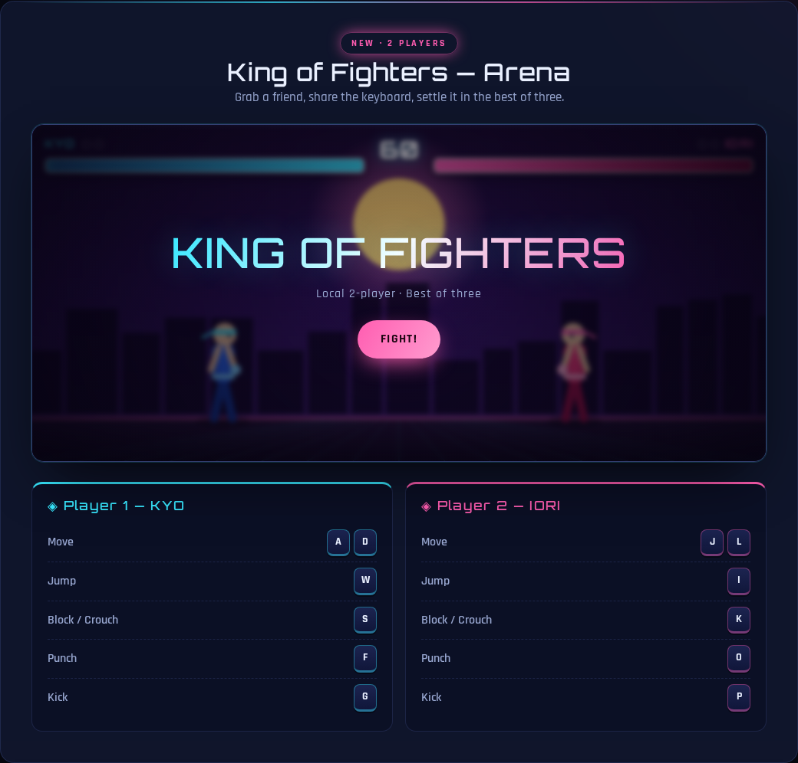
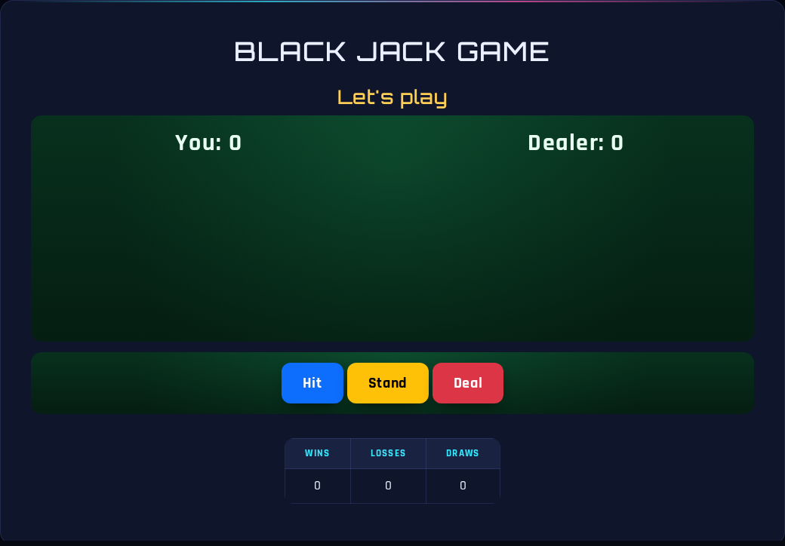
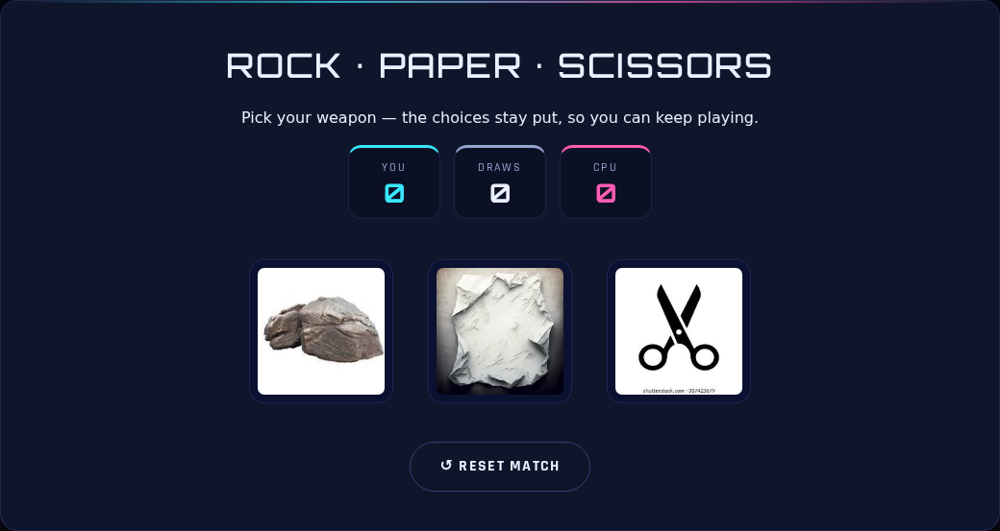
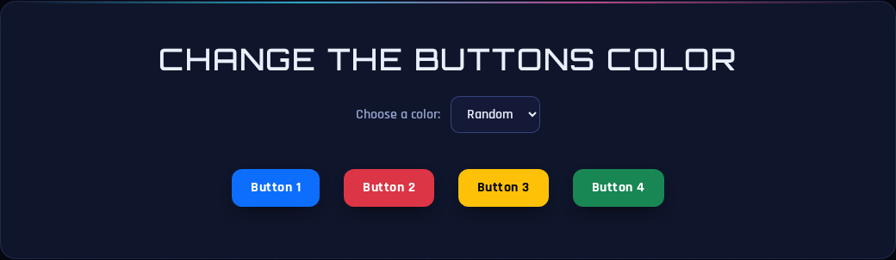

# ARCADE.JS Demonstration

Welcome to the ARCADE.JS demonstration page! This file showcases screenshots and descriptions for all the foundational vanilla-JavaScript web games and toys available in this collection.

## Games & Toys Overview

### 1. King of Fighters — Arena
A local two-player, canvas-based fighting game featuring health bars, a round timer, blocking, KO mechanics, and best-of-three matches.

### 2. Blackjack
A classic hit / stand / deal card game where you play against the dealer to try and reach 21.

### 3. Rock · Paper · Scissors
Play the classic hand game against the computer, featuring a scoreboard to track your wins, draws, and losses.

### 4. Change the Buttons Color
A simple toy that lets you recolor a set of buttons randomly or by selecting specific colors from a dropdown menu.

### 5. Image Generator
A tool to append random cat images (or placeholder images) to the page with a simple click.

### 6. Your Age in Days
Enter your birthdate through browser prompts to calculate and display your approximate age in days.

---
*Built with plain HTML, CSS and DOM manipulation. No frameworks, no build step.*